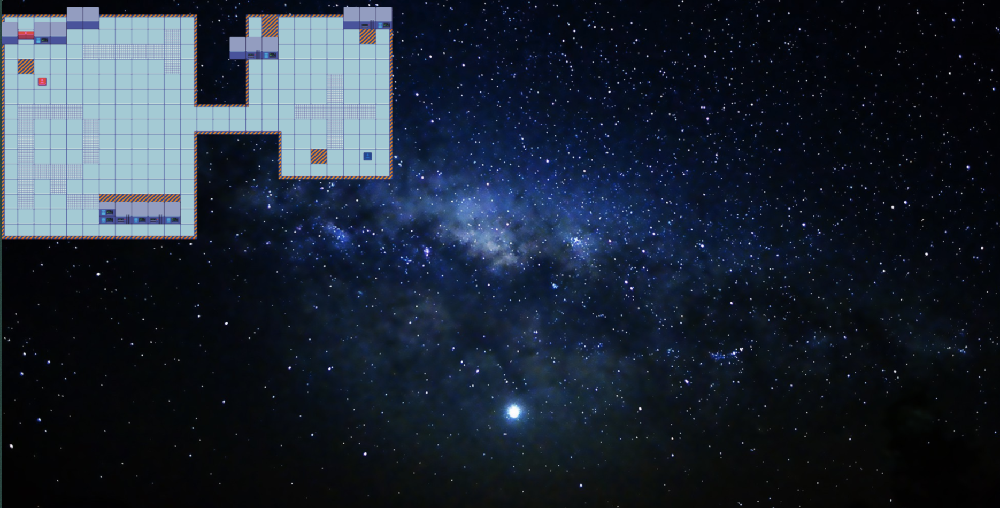

# Learning Pixi (2D game library)

## [PixiJS — Getting Started](https://pixijs.com/8.x/guides/getting-started/intro)

- Entry point: `Experience.tsx` — renders the main game component and composes the Pixi scene.

- Pixi v8 change (React integration):
  - The standalone React wrapper components were removed.
  - Pattern now: import raw Pixi classes, then use an "extend" helper from your React–Pixi bridge to convert those classes into React components that you can use in JSX.

- The ```<Application>``` component is used to wrap your @pixi/react app. The ```<Application>``` component can take all props that can be set on PIXI.Application. Basically a top level component to encapsulate the whole pixi 

- The Container class is the foundation of PixiJS's scene graph system. Containers act as groups of scene objects, allowing you to build complex hierarchies, organize rendering layers, and apply transforms or effects to groups of objects.

- Sprites are the foundational visual elements in PixiJS. They represent a single image to be displayed on the screen. Each Sprite contains a Texture to be drawn, along with all the transformation and display state required to function in the scene graph.


### *Here the star background is also a sprite and the map (main game area) is also a sprite that renders on it*

--- 

## Attributes of main game area

```ts

export const TILE_SIZE = 32 // It specifies the pixel box size
export const COLS= 26 //Total no. of cols for the game area
export const ROWS = 17 //Total no. of rows for the game area

export const GAME_WIDTH = TILE_SIZE * COLS - TILE_SIZE*2; //Total game width but 2 pixels left from left and right
export const GAME_HEIGHT = TILE_SIZE * ROWS - TILE_SIZE*2; //Total game height but 2 pixels left from top and bottom

export const OFFSET_X = 0;
export const OFFSET_Y = TILE_SIZE/2;


```
```psql
   ↑ Y-axis (top of screen)
   |
   | OFFSET_Y = 16 px (grid starts a bit lower)
   |      
   |   ┌──────────────────────────────────────────────────────────────┐
   |   │ <─── Trimmed TOP border (TILE_SIZE = 32 px) ───>             │
   |   │                                                              │
   |   │  +--------------------------------------------------------+  │
   |   │  |                                                        |  │
   |   │  |      PLAYABLE AREA (inside GAME_WIDTH x GAME_HEIGHT)   |  │
   |   │  |                                                        |  │
   |   │  |   Each small box = TILE_SIZE (32×32 px)                |  │
   |   │  |                                                        |  │
   |   │  |   Total = 26 cols × 17 rows                            |  │
   |   │  |   But effective area excludes 1 tile from each edge →  |  │
   |   │  |   GAME_WIDTH  = 832 - 64 = 768 px                      |  │
   |   │  |   GAME_HEIGHT = 544 - 64 = 480 px                      |  │
   |   │  |                                                        |  │
   |   │  +--------------------------------------------------------+  │
   |   │                                                              │
   |   │ <─── Trimmed BOTTOM border (TILE_SIZE = 32 px) ───>          │
   |   └──────────────────────────────────────────────────────────────┘
   |
   ↓ (rest of canvas)


   <------------------------- X-axis ---------------------------->

OFFSET_X = 0 → grid starts at the left edge of the screen
```

---

```diff
Screen pixels:
+---------------------------------------------------+
| (0,0)    (32,0)   (64,0)   (96,0)   (128,0)      |
|   ┌────┬────┬────┬────┬────┐                     |
|   │ 0,0│ 1,0│ 2,0│ 3,0│ 4,0│ →  X Axis →         |
|   ├────┼────┼────┼────┼────┤                     |
|   │ 0,1│ 1,1│ 2,1│ 3,1│ 4,1│                     |
|   ├────┼────┼────┼────┼────┤                     |
|   │ 0,2│ 1,2│🦸‍♂️│ 3,2│ 4,2│   ← Hero at tile (2,2)
|   ├────┼────┼────┼────┼────┤                     |
|   │ 0,3│ 1,3│ 2,3│ 3,3│ 4,3│                     |
|   └────┴────┴────┴────┴────┘                     |
+---------------------------------------------------+
```